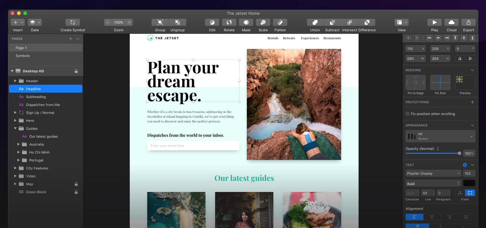
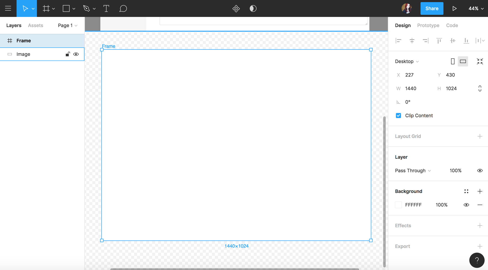
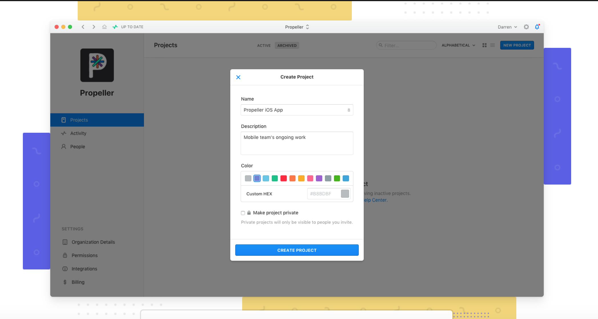
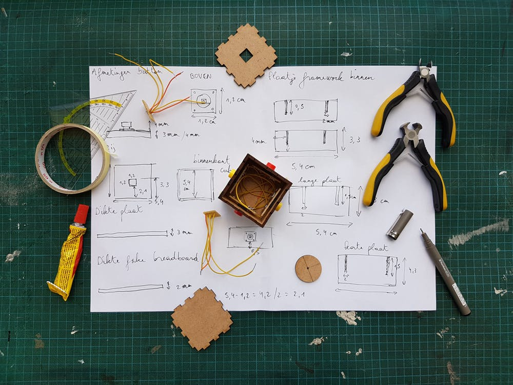

# Review

^ Let's review your personas and user journey's

---

# Tools

 

^ There are  a lot of different tools available to UX Designers. What you use will depend on your personal preference and the work environment you find yourself in. We will start by reviewing some of the most common.

---

# Sketch

^ Sketch is a Mac-only design tool. Available as a download for $99 with unlimited updates for the year. Once the year is up, you must re-purchase a license to continue getting updates, or pay nothing and use the last version you updated to. Link: https://www.sketchapp.com/

---

## What can you do with it?

1. Design low-high-fidelity
2. Wireframing
3. Prototyping
4. Create and share a library

---

## What can't you do with it?

1. Print Design
2. Version control
3. Collaboration (yet...)

---

# Activity

Set up a free trial of Sketch (if you do not already have it). https://www.sketchapp.com/docs/getting-started/

Review the interface https://www.sketchapp.com/docs/the-interface/

---

# Figma

^ Figma is a design and collaboration tool that can be used in the browser or as a download. A single-user version is available for free with additional users and features available for a monthly fee. Link: https://www.figma.com/

---

## What can you do with it?

1. Design low-high-fidelity
2. Wireframing
3. Prototyping
4. Create and share a library
5. Collaboration
6. Version Control

---

## What can't you do with it?

1. Print design

---

# Activity

Set up a free trial of Figma (if you do not already have it). https://www.figma.com/

Review the interface https://help.figma.com/article/116-getting-started

---

# Adobe XD

^  Adobe XD is a design tool that allows you to design and prototype user interfaces. It integrates with other Adobe tools like Photoshop and AI. They offer free starter plan. Link: https://www.adobe.com/products/xd.html

---

## What can you do with it?

1. Design low-high-fidelity
2. Wireframing
3. Prototyping
4. Create and share a library
5. Collaboration

---

## What can't you do with it?

1. Print Design (not 100% sure on this one)
2. Version control

---

# Abstract

^  Abstract is not a design tool in itself, it is used in conjunction with SketchApp. Abstract allows you to version control your Sketch files. It requires a monthly, per user fee. Link: https://www.goabstract.com/

---

# Invision //
# Framer //
# Marvel //

^  Invision, Framer, and marvel are prototyping tools.

^  Invision integrates with other design tools like Photoshop and Sketch. It offers whitboarding, collaboration tools, and highly functioning prototyping. Link: https://www.invisionapp.com/

^  No longer just a prototyping tool, Framer X offers design within Framer. Link: https://www.framer.com/

^  Marvel is similar to Framer in that it offers design and prototyping. Link: https://marvelapp.com/

---

# Lab Activity / Take Home: 

Using the design tool of your choice, create wireframes for the intended user flow.
